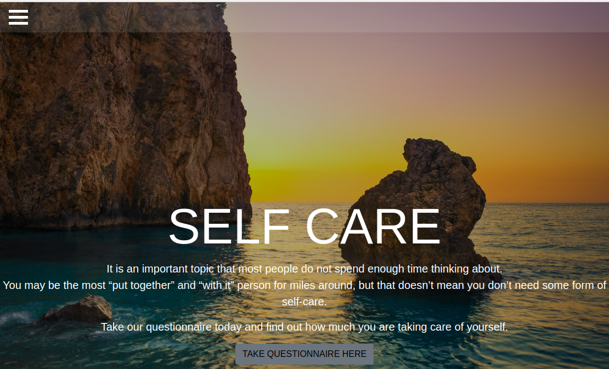

# SELF-CARE
#### A self-care web application, 6th September 2019
#### By **Cindy Wambui, Christine Lydia , Sharon Faith, Phillis Ngina, Alfred Otieno**
## Description
This is a website that tells users what they need to know about self-care. It contains information about four different key types of self-care, that is, emotionial, physical, social and mental. It gives detailed explanations of each and advice on how to practice each of them. There is a quote section with relevant pieces of information, as well as a questionnaire the user can fill to check out how well they really are taking care of themselves. After filling in the questionnaire, the user is shown what percentage they got in each section and some advice, so they can know which particular sections they need to work well in. In addition to that, the user can read testimonials present and even post one of their own. The user can submit a message to contact us directly.

## A sample screenshot of the application

This is the landing section for the application.

This is the landing section of the application.

## Behaviour Driven Development
| Behaviour | input | output |
| ------------ | ------------ | ------------- |
| On landing page | User clicks on menu icon on top left | Dropdown menu containing sections of the webpage is displayed |
| In about section | User clicks on self-care types titles | Information underneath appears and toggles when title is clicked again |
| Hover in quote section | User hovers over blank box | The quote in the box is displayed |
| Questionnaire filled | User fills in questionnaire | On submit their results are displayed to them |
| Post button in testimonials clicked  | User fills form and clicks post | Their testimonial is posted |
| In contact section | User submits contact message | An alert is displayed to them |

## Setup/Installation Requirements
* Use a desktop or laptop, phone or tablet.
* To install, go to URL : https://github.com/Cindywambui/Selfcare-webpage then clone or download repository
* Unzip the file
* Move contents to folder you desire

## Live Site
* Access the live site at: https://cindywambui.github.io/Selfcare-webpage/

## Known Bugs
- The menu icon on the top left conrner of the landing section only works when you are at the complete top of the webpage.
## Technologies Used
- HTML and CSS
- JavaScript
- JQuery
- Bootstrap
## Support and contact details
Github accounts: SharonFaith, christylydia34, Cindywambui, Ngina07, Alfred-1234
### License
*MIT License*
Copyright (c) {2019} **Cindy Wambui, Christine Lydia , Sharon Faith, Phillis Ngina, Alfred Otieno**

Permission is hereby granted, free of charge, to any person obtaining a copy
of this software and associated documentation files (the "Software"), to deal
in the Software without restriction, including without limitation the rights
to use, copy, modify, merge, publish, distribute, sublicense, and/or sell
copies of the Software, and to permit persons to whom the Software is
furnished to do so, subject to the following conditions:

The above copyright notice and this permission notice shall be included in all
copies or substantial portions of the Software.

THE SOFTWARE IS PROVIDED "AS IS", WITHOUT WARRANTY OF ANY KIND, EXPRESS OR
IMPLIED, INCLUDING BUT NOT LIMITED TO THE WARRANTIES OF MERCHANTABILITY,
FITNESS FOR A PARTICULAR PURPOSE AND NONINFRINGEMENT. IN NO EVENT SHALL THE
AUTHORS OR COPYRIGHT HOLDERS BE LIABLE FOR ANY CLAIM, DAMAGES OR OTHER
LIABILITY, WHETHER IN AN ACTION OF CONTRACT, TORT OR OTHERWISE, ARISING FROM,
OUT OF OR IN CONNECTION WITH THE SOFTWARE OR THE USE OR OTHER DEALINGS IN THE
SOFTWARE.
